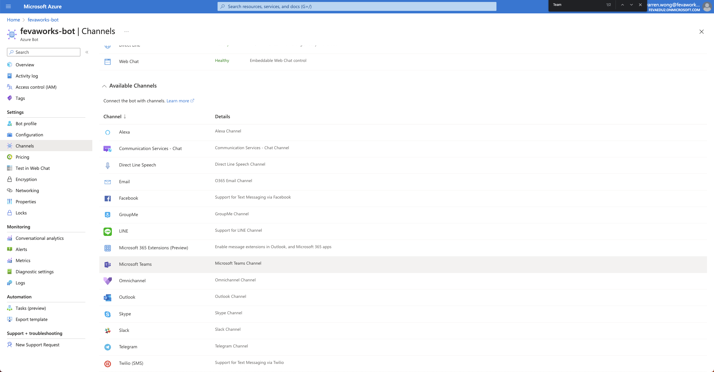
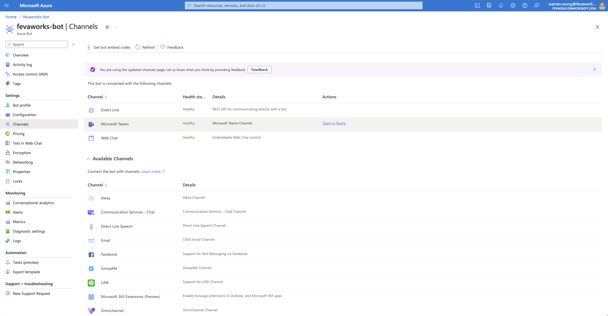
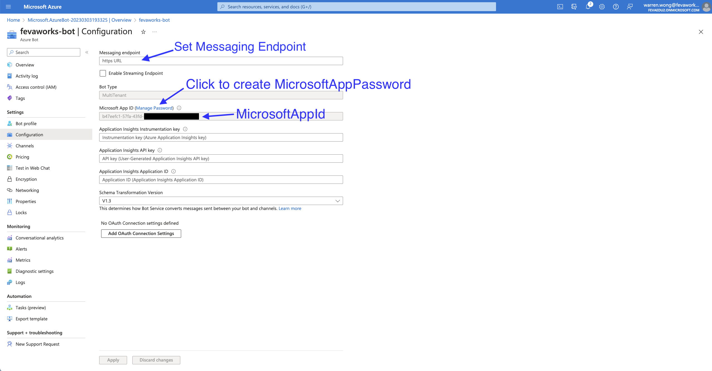

# Teams Chatbot using OpenAI's GPT-3

This is a Teams chatbot that uses Azure OpenAI's GPT-3 to generate responses to user messages.

## Prerequisites

To run this chatbot, you will need the following:

- Node.js and npm installed on your machine.

## Installation

1. Clone this repository to your local machine.

2. Install dependencies by running:
```
npm install
```

3. Set up the environment variables in a `.env` file. You can copy the `.env.example` file and rename it to `.env`, then replace the placeholders with your own API key and bot token.

```
MicrosoftAppType=MultiTenant
MicrosoftAppId=
MicrosoftAppPassword=
MicrosoftAppTenantId=

OPENAI_NAME=
OPENAI_API_KEY=
ENGINE=
MAX_TOKENS=
TEMPERATURE=
FREQUENCY_PENALTY=
PRESENCE_PENALTY=
TOP_P=
STOP=null
PREPROMPT=
```

Make sure to keep the `.env` file private and do not commit it to version control.

## Usage

1. Start the bot by running the following command:
```
python bot.py
```
or in Docker
```
docker build -t openai-teams-bot .
docker run -d -p 3978:3978 --env-file .env openai-teams-bot
```

2. Set the Message Endpoint in Azure Bot configuration

3. Enable the Teams Channel



4. Click "Open in Teams" then send a message to your bot in Teams, and it should respond with a generated message


## Reference

For local testing in Teams channel, you can expose your localhost and set the exposed endpoint. For example:
```
npx localtunnel --port 3978
```

To retrieve the MicrosoftAppId and MicrosoftAppPassword, you can create a new Azure Bot Service: https://portal.azure.com/#create/Microsoft.AzureBot"

MicrosoftAppId and MicrosoftAppPassword can be found from the Azure Bot Service configuration page.


## Contributing

If you'd like to contribute to this project, please open an issue or pull request on GitHub.

## License

This project is licensed under the MIT License. See the `LICENSE` file for more information.

